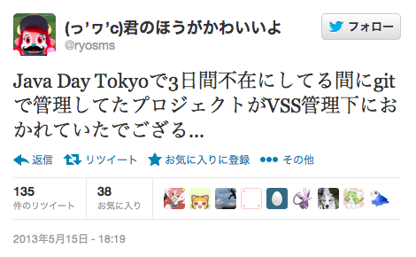
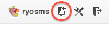
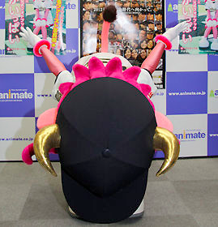

# 広島Git

subtitle
:	Bareリポジトリについて

author
:   @ryosms

date
:   2013/06/01

theme
:	rabbit

# 自己紹介(1)

* Twitter: [@ryosms](https://twitter.com/ryosms)
* GitHub: [ryosms](https://github.com/ryosms)
* 岡山Gitユーザ会([#okagit](https://twitter.com/search/realtime?q=%23okagit&src=typd))代表
	* [http://okagit.github.io/](http://okagit.github.io/)
* VSCへの取り組みとか
	* [http://goo.gl/9Qaqp](http://twilog.org/ryosms/search?word=VSS)

# 自己紹介(2)

{:relative_width="70" reflect_ratio='0.5'}

# Bareリポジトリとは

* 所謂「中央リポジトリ」
	* ワーキングディレクトリを持たない
	* 操作はpushで
* remote ≒ Bare
* Bare != Bear

# 作り方(1)

* 新規作成

		git init --bare

* 既存リポジトリから

		git clone --bare hoge fuga

	* sharedオプションとかもあるけど

# 作り方(2)

* ホスティングサービス
	* 例）GitHub

{:relative_width="90" reflect_ratio="0.5"}

{:relative_width="60" reflect_ratio="0.5"}

# おしまい

* ご静聴ありがとうございました

{:relative_height='90' reflect_ratio='0.5'}

